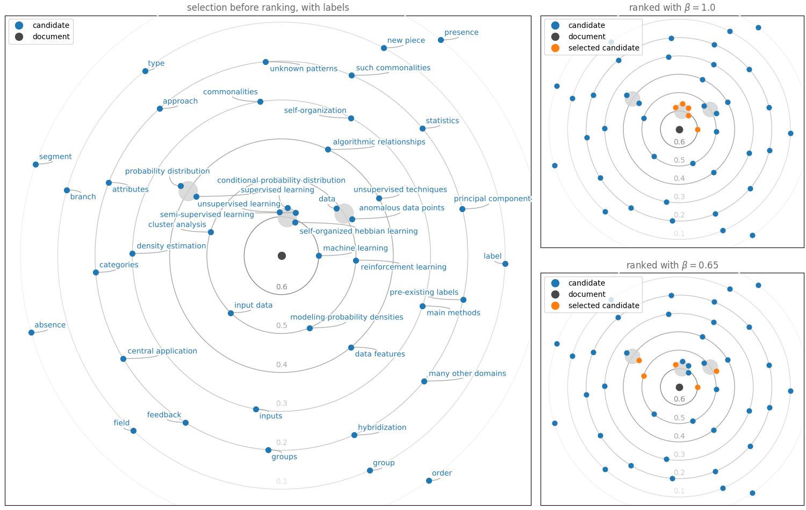

# Solar visualization for cosine similarity

Visualization of the cosine similarity of phrases in a document with respect to the document and the phrases themselves.

Inspired by [https://www.oreilly.com/content/a-new-visualization-to-beautifully-explore-correlations/](https://www.oreilly.com/content/a-new-visualization-to-beautifully-explore-correlations/). Uses [adjustText](https://github.com/Phlya/adjustText) for label positioning.

This is a side product of my bachelor thesis on automatic keyphrase extraction, provided for the public domain. Use as you like as long as you give required credits to its dependencies.